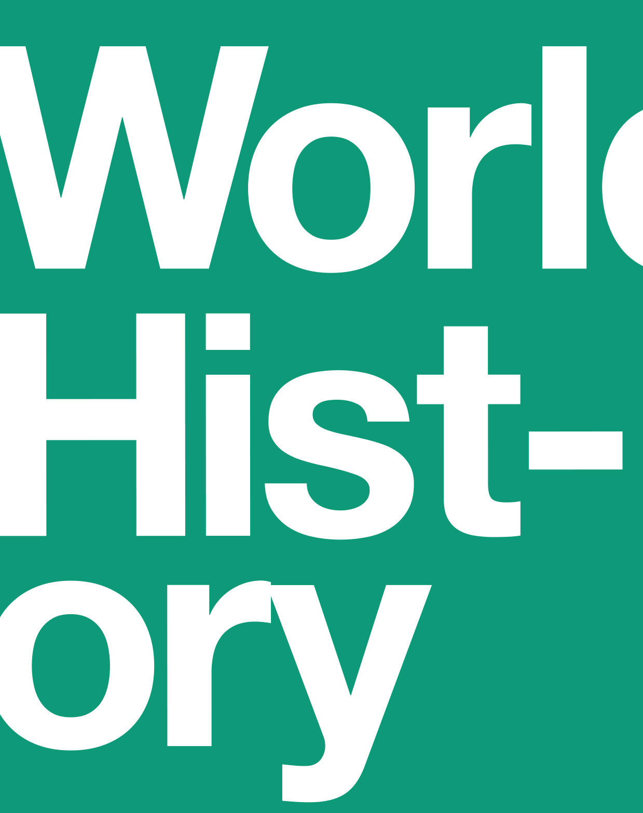
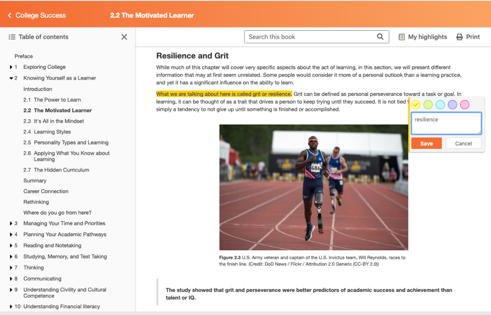

  

# openstax  

Volume 1   
to 1500  

# World History, Volume 1: to 1500  

SENIOR CONTRIBUTING AUTHORS  
ANN KORDAS, JOHNSON & WALES UNIVERSITY  
RYAN J. LYNCH, COLUMBUS STATE UNIVERSITY  
BROOKE NELSON, FORMERLY CALIFORNIA STATE UNIVERSITY  
JULIE TATLOCK, MOUNT MARY UNIVERSITY  

# openstax  

OpenStax   
Rice University   
6100 Main Street MS-375   
Houston, Texas 77005 To learn more about OpenStax, visit https://openstax.org.   
Individual print copies and bulk orders can be purchased through our website.  

©2023 Rice University. Textbook content produced by OpenStax is licensed under a Creative Commons Attribution 4.0 International License (CC BY 4.0). Under this license, any user of this textbook or the textbook contents herein must provide proper attribution as follows:  

If you redistribute this textbook in a digital format (including but not limited to PDF and HTML), then you must retain on every page the following attribution:   
“Access for free at openstax.org.”   
If you redistribute this textbook in a print format, then you must include on every physical page the following attribution:   
“Access for free at openstax.org.”   
If you redistribute part of this textbook, then you must retain in every digital format page view (including but not limited to PDF and HTML) and on every physical printed page the following attribution:   
“Access for free at openstax.org.”   
If you use this textbook as a bibliographic reference, please include   
https://openstax.org/details/books/world-history-volume-1 in your citation.  

For questions regarding this licensing, please contact support@openstax.org.  

# Trademarks  

The OpenStax name, OpenStax logo, OpenStax book covers, OpenStax CNX name, OpenStax CNX logo, OpenStax Tutor name, Openstax Tutor logo, Connexions name, Connexions logo, Rice University name, and Rice University logo are not subject to the license and may not be reproduced without the prior and express written consent of Rice University.  

HARDCOVER BOOK ISBN-13   
B&W PAPERBACK BOOK ISBN-13   
DIGITAL VERSION ISBN-13   
ORIGINAL PUBLICATION YEAR   
1 2 3 4 5 6 7 8 9 10 RS 23   
978-1-711471-41-9   
978-1-711471-42-6   
978-1-951693-67-1   
2023  

# OPENSTAX  

OpenStax provides free, peer-reviewed, openly licensed textbooks for introductory college and Advanced Placement® courses and low-cost, personalized courseware that helps students learn. A nonprofit ed tech initiative based at Rice University, we’re committed to helping students access the tools they need to complete their courses and meet their educational goals.  

# RICE UNIVERSITY  

OpenStax is an initiative of Rice University. As a leading research university with a distinctive commitment to undergraduate education, Rice University aspires to path-breaking research, unsurpassed teaching, and contributions to the betterment of our world. It seeks to fulfill this mission by cultivating a diverse community of learning and discovery that produces leaders across the spectrum of human endeavor.  

# PHILANTHROPIC SUPPORT  

OpenStax is grateful for the generous philanthropic partners who advance our mission to improve educational access and learning for everyone. To see the impact of our supporter community and our most updated list of partners, please visit openstax.org/impact.  

Arnold Ventures   
Chan Zuckerberg Initiative   
Chegg, Inc.   
Arthur and Carlyse Ciocca Charitable Foundation Digital Promise   
Ann and John Doerr   
Bill & Melinda Gates Foundation   
Girard Foundation   
Google Inc.   
The William and Flora Hewlett Foundation   
The Hewlett-Packard Company   
Intel Inc.   
Rusty and John Jaggers   
The Calvin K. Kazanjian Economics Foundation Charles Koch Foundation   
Leon Lowenstein Foundation, Inc.   
The Maxfield Foundation   
Burt and Deedee McMurtry   
Michelson 20MM Foundation   
National Science Foundation   
The Open Society Foundations   
Jumee Yhu and David E. Park III   
Brian D. Patterson USA-International Foundation   
The Bill and Stephanie Sick Fund   
Steven L. Smith & Diana T. Go   
Stand Together   
Robin and Sandy Stuart Foundation   
The Stuart Family Foundation   
Tammy and Guillermo Treviño   
Valhalla Charitable Foundation   
White Star Education Foundation   
Schmidt Futures   
William Marsh Rice University  

# openstax  

# Study where you want, what you want, when you want.  

When you access your book in our web view, you can use our new online highlighting and note-taking features to create your own study guides.  

Our books are free and flexible, forever. Get started at openstax.org/details/books/world-history-volume-1  

  

Access. The future of education. openstax.org  

# Preface 1  

# Unit 1 Early Human Societies  

# CHAPTER 1 Understanding the Past 9  

Introduction 9   
1.1 Developing a Global Perspective 10   
1.2 Primary Sources 14   
1.3 Causation and Interpretation in History 25   
Key Terms 31   
Section Summary 31   
Assessments 32  

# CHAPTER 2 Early Humans 35  

Introduction 35   
2.1 Early Human Evolution and Migration 36   
2.2 People in the Paleolithic Age 48   
2.3 The Neolithic Revolution 55   
Key Terms 64   
Section Summary 64   
Assessments 65  

# CHAPTER 3 Early Civilizations and Urban Societies 69  

Introduction 69   
3.1 Early Civilizations 71   
3.2 Ancient Mesopotamia 76   
3.3 Ancient Egypt 88   
3.4 The Indus Valley Civilization 99   
Key Terms 107   
Section Summary 107   
Assessments 108  

# CHAPTER 4 The Near East 113  

Introduction 113   
4.1 From Old Babylon to the Medes 115   
4.2 Egypt’s New Kingdom 130   
4.3 The Persian Empire 142   
4.4 The Hebrews 151   
Key Terms 160   
Section Summary 160   
Assessments 161  

# CHAPTER 5 Asia in Ancient Times 165  

Introduction 165   
5.1 Ancient China 167   
5.2 The Steppes 180   
5.3 Korea, Japan, and Southeast Asia 185   
5.4 Vedic India to the Fall of the Maurya Empire 201   
Key Terms 212   
Section Summary 212   
Assessments 213  

# Unit 2 States And Empires, 1000 BCE–500 CE  

# CHAPTER 6 Mediterranean Peoples 217  

Introduction 217   
6.1 Early Mediterranean Peoples 219   
6.2 Ancient Greece 225   
6.3 The Hellenistic Era 242   
6.4 The Roman Republic 249   
6.5 The Age of Augustus 260   
Key Terms 266   
Section Summary 266   
Assessments 268  

# CHAPTER 7 Experiencing the Roman Empire 273  

Introduction 273   
7.1 The Daily Life of a Roman Family 274   
7.2 Slavery in the Roman Empire 280   
7.3 The Roman Economy: Trade, Taxes, and Conquest 286   
7.4 Religion in the Roman Empire 289   
7.5 The Regions of Rome 296   
Key Terms 303   
Section Summary 303   
Assessments 304  

# CHAPTER 8 The Americas in Ancient Times 309  

Introduction 309   
8.1 Populating and Settling the Americas 311   
8.2 Early Cultures and Civilizations in the Americas 323   
8.3 The Age of Empires in the Americas 342   
Key Terms 361   
Section Summary 361   
Assessments 362  

# CHAPTER 9 Africa in Ancient Times 367  

Introduction 367   
9.1 Africa’s Geography and Climate 369   
9.2 The Emergence of Farming and the Bantu Migrations 379   
9.3 The Kingdom of Kush 385   
9.4 North Africa’s Mediterranean and Trans-Saharan Connections 394   
Key Terms 405   
Section Summary 405   
Assessments 406  

# Unit 3 An Age Of Religion, 500–1200 CE  

# CHAPTER 10 Empires of Faith 411  

Introduction 411   
10.1 The Eastward Shift 413   
10.2 The Byzantine Empire and Persia 424   
10.3 The Kingdoms of Aksum and Himyar 431   
10.4 The Margins of Empire 437   
Key Terms 444   
Section Summary 444   
Assessments 445  

# CHAPTER 11 The Rise of Islam and the Caliphates 449  

Introduction 449   
11.1 The Rise and Message of Islam 451   
11.2 The Arab-Islamic Conquests and the First Islamic States 465   
11.3 Islamization and Religious Rule under Islam 474   
Key Terms 482   
Section Summary 482   
Assessments 483  

# CHAPTER 12 India, the Indian Ocean Basin, and East Asia 487  

Introduction 487   
12.1 The Indian Ocean World in the Early Middle Ages 488   
12.2 East-West Interactions in the Early Middle Ages 502   
12.3 Border States: Sogdiana, Korea, and Japan 516   
Key Terms 528   
Section Summary 528   
Assessments 529  

# CHAPTER 13 The Post-Roman West and the Crusading Movement 533  

Introduction 533   
13.1 The Post-Roman West in the Early Middle Ages 535   
13.2 The Seljuk Migration and the Call from the East 549   
13.3 Patriarch and Papacy: The Church and the Call to Crusade 558   
13.4 The Crusading Movement 563   
Key Terms 574   
Section Summary 574   
Assessments 575  

# CHAPTER 14 Pax Mongolica: The Steppe Empire of the Mongols 579  

Introduction 579   
14.1 Song China and the Steppe Peoples 581   
14.2 Chinggis Khan and the Early Mongol Empire 590   
14.3 The Mongol Empire Fragments 598   
14.4 Christianity and Islam outside Central Asia 605   
Key Terms 615   
Section Summary 615   
Assessments 616  

# CHAPTER 15 States and Societies in Sub-Saharan Africa 621  

Introduction 621   
15.1 Culture and Society in Medieval Africa 623   
15.2 Medieval Sub-Saharan Africa 634   
15.3 The People of the Sahel 647   
Key Terms 656   
Section Summary 656   
Assessments 657  

# CHAPTER 16 Climate Change and Plague in the Fourteenth Century 661  

Introduction 661   
16.1 Asia, North Africa, and Europe in the Early Fourteenth Century 662   
16.2 Famine, Climate Change, and Migration 672   
16.3 The Black Death from East to West 679   
16.4 The Long-Term Effects of Global Transformation 687   
Key Terms 692   
Section Summary 692   
Assessments 693  

# CHAPTER 17 The Ottomans, the Mamluks, and the Ming 697  

Introduction 697   
17.1 The Ottomans and the Mongols 699   
17.2 From the Mamluks to Ming China 720   
17.3 Gunpowder and Nomads in a Transitional Age 733   
Key Terms 742   
Section Summary 742   
Assessments 743   
Appendix A Glossary 747   
Appendix B WorldHistory, Volume 1, to 1500: Maps and Timelines 753   
Appendix C World Maps 757   
Appendix D Recommended Resources for the Study of World History 763   
Index 765  